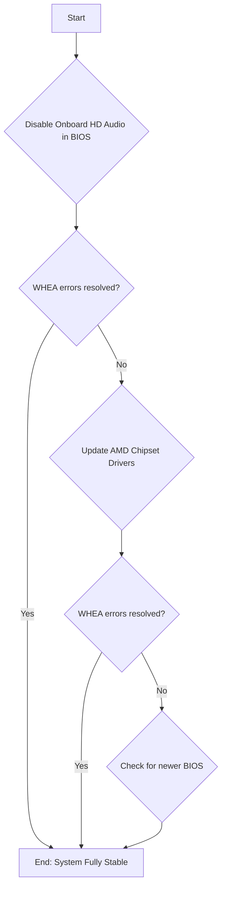

# Analysis of Power On Issue v10

## One-Liner Copy-Ready Version for System Status

**Current Status:** WHEA log analyzed. Errors point to the onboard AMD High Definition Audio device. Next step is to disable this device in the BIOS to see if errors cease.

## PURPOSE OF THIS REPORT

This report is a living document intended to track and troubleshoot system stability issues. It should be retained and updated whenever new information or issues arise. Its purpose is to provide a comprehensive history and plan for resolving complex hardware and software problems.

## 1. WHEA Error Log Analysis

The user has provided the output from the WHEA diagnostic script. All errors are identical and point to a specific hardware interaction.

### WHEA Log Output:
```
Time   : 10/05/2026 00:39:37
Source : 8
BDF    : 0x40:0x1:0x1
Vendor : 0x1022
Device : 0x1483
Msg    : A corrected hardware error has occurred.
         
         Component: PCI Express Root Port
         Error Source: Generic
         
         Primary Bus:Device:Function: 0x40:0x1:0x1
         Secondary Bus:Device:Function: 0x41:0x0:0x0
         Primary Device Name:PCI\VEN_1022&DEV_1483&SUBSYS_88151043&REV_00
         Secondary Device Name:PCI\VEN_1002&DEV_1478&SUBSYS_00000000&REV_C0

... (multiple identical entries) ...
```

### Analysis:

*   **Primary Device (`PCI\VEN_1022&DEV_1483`):** This is an **AMD PCIe Root Port**, which is part of your motherboard's chipset.
*   **Secondary Device (`PCI\VEN_1002&DEV_1478`):** This is the **AMD On-chip High Definition Audio Device**. This is an integrated component of your CPU/chipset, primarily used for passing audio through DisplayPort or HDMI connections.

**Conclusion:** The errors are being generated by the PCIe root port that the onboard AMD HD Audio controller is connected to. This is not related to a discrete graphics card, add-in card, or storage device. It's an issue with an integrated system component.

## 2. Updated Troubleshooting Plan



## 3. Next Steps & Recommendations

Since the issue is with an integrated component, our troubleshooting steps are focused on BIOS settings and drivers.

### **Primary Recommendation: Disable Onboard HD Audio in BIOS**

This is the most direct and likely solution. If you are using a separate sound card or a USB audio interface/headset, you probably don't need this device enabled.

1.  **Reboot your computer and enter the BIOS.** (Usually by pressing the 'Del' or 'F2' key during startup).
2.  Navigate to the **'Advanced'** section.
3.  Find the **'Onboard Devices Configuration'** menu.
4.  Locate the **'HD Audio Controller'** (or similar) option.
5.  Set it to **'Disabled'**.
6.  **Save Changes and Exit** the BIOS.
7.  After booting into Windows, monitor the system to see if the WHEA errors reappear in the Event Log.

### Secondary Recommendations (if the above does not work):

1.  **Update AMD Chipset Drivers:** Download and install the latest AMD Chipset Drivers specifically for your WRX80 motherboard from the ASUS support website. This is crucial for the stability of all onboard devices.
2.  **Check for a Newer BIOS:** While your current BIOS fixed the shutdown issue, check the ASUS support page again to see if a newer version has been released in the meantime that might address PCIe stability.

Please start with the primary recommendation of disabling the HD Audio Controller in the BIOS. This is a non-destructive and easily reversible step that will likely resolve the recurring WHEA errors.
