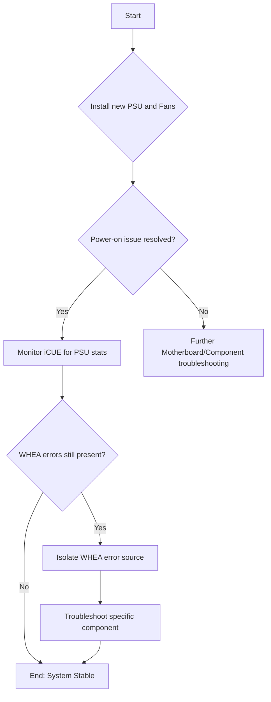

# Analysis of Power On Issue v4

## 1. Summary of the Issue & Actions Taken

The user is experiencing a power-on issue with their workstation, requiring a PSU power cycle to start. The issue persists after a BIOS update that fixed previous unexpected shutdowns. The system also logs "corrected hardware errors" (WHEA-Logger).

The user has decided to take the following actions:
1.  Improve room and case cooling by adding more fans.
2.  Replace the existing PSU with a new Corsair AX1600i.
3.  Connect the new PSU to a USB header to monitor it with iCUE.

This is the correct course of action. Replacing the PSU directly addresses the most likely cause of the power-on issue.

## 2. Troubleshooting Plan

## 3. Next Steps & Recommendations

With the new PSU, the troubleshooting plan is as follows:

### 1. After Installing the New PSU

*   **Monitor for the Power-On Issue:** The primary goal is to see if the power-on issue is resolved. With the new PSU, the computer should start consistently with the power button.
*   **Monitor iCUE Data:** The data from the Corsair AX1600i in iCUE will be very valuable. Keep an eye on the power draw, efficiency, and temperature of the PSU. Any abnormal readings could indicate a problem, though this is unlikely with a new, high-quality PSU.

### 2. Address the WHEA-Logger Errors

Once the new PSU is installed and the system is stable, the next step is to address the persistent WHEA errors. It is possible, though not guaranteed, that the old, faulty PSU was contributing to system instability and causing these errors.

If the WHEA errors *continue* with the new PSU, then we have confirmed that the PSU was not the cause of these specific errors. In that case, the investigation should proceed as follows:

1.  **Identify the Source of the WHEA Errors:**
    *   Open the **Event Viewer** in Windows.
    *   Go to **Windows Logs > System**.
    *   Find a "WHEA-Logger" event.
    *   In the "Details" tab, look for information about the "Component" and "Error Source". This will often include a "Bus:Device:Function" identifier that can be used to pinpoint the exact hardware component that is causing the error.

2.  **Troubleshoot the Identified Component:**
    *   Once the component is identified (e.g., graphics card, NVMe drive, etc.), the next steps are:
        *   **Reseat the component:** Power down the system, unplug it, and physically remove and reinstall the component to ensure it is seated correctly in its slot.
        *   **Update drivers:** Ensure that the component has the latest drivers and firmware.
        *   **Test in a different slot:** If the component is a PCIe card, try moving it to a different PCIe slot.
        *   **Isolate the component:** If possible, temporarily remove the component to see if the WHEA errors stop. This is a definitive way to confirm the source of the errors.

## 4. Summary of the Plan

1.  **Install the new Corsair AX1600i PSU and additional fans.**
2.  **Verify that the power-on issue is resolved.**
3.  **If the WHEA errors persist, use the Event Viewer to identify the faulty component and proceed with troubleshooting it.**

Your plan to replace the PSU is the right one, and I am confident it will resolve the power-on issue. I am ready to assist with the next steps once the new hardware is installed.
