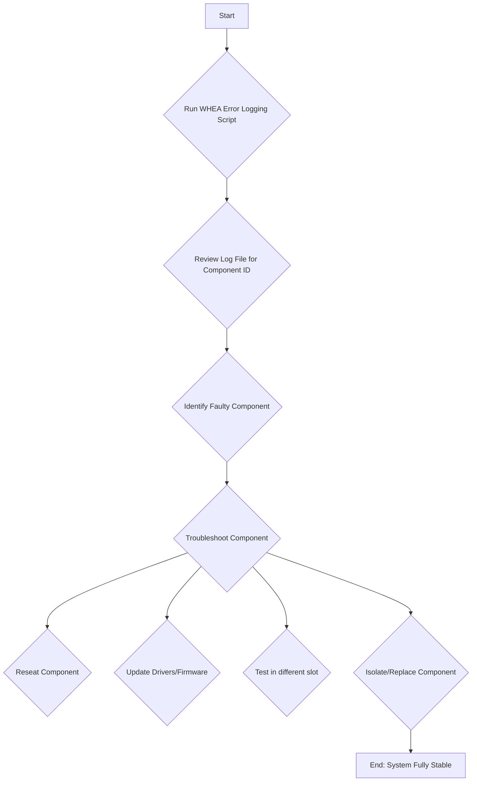

# Analysis of Power On Issue v9

## One-Liner Copy-Ready Version for System Status

**Current Status:** PSU replaced, power-on and shutdowns resolved. Now diagnosing persistent WHEA errors using `diagnose_whea.ps1` or the condensed one-liner script to pinpoint faulty hardware component.

## IMPORTANT: AI Assistant Response Format

**Please note:** When interacting with me, the AI assistant, I will provide my responses in a concise "one-liner" format. This will be followed by an "expanded version" for more detail.

## PURPOSE OF THIS REPORT

This report is a living document intended to track and troubleshoot system stability issues. It should be retained and updated whenever new information or issues arise. Its purpose is to provide a comprehensive history and plan for resolving complex hardware and software problems.

## 1. Summary & Resolution of Power-On Issue

The user has successfully replaced their old PSU with a new Corsair AX1600i. This has resolved the primary issue of the system not powering on consistently. The unexpected shutdowns are also gone. The system is now stable and usable.

The remaining issue is the "corrected hardware errors" (WHEA-Logger) that are still present in the event logs. The focus of this report is to provide a method for diagnosing these errors.

## 2. Troubleshooting Plan for WHEA Errors



## 3. Real-time WHEA Error Diagnosis and Logging

The following PowerShell script can be used to get detailed information about the WHEA errors from the Windows Event Log. This will help us identify the specific hardware component that is causing the errors.

### `diagnose_whea.ps1`
```powershell
# This script retrieves detailed information about WHEA-Logger events
# from the System event log and saves it to a log file on the Desktop.

$logFile = "$env:USERPROFILE\Desktop\WHEA_Error_Log.txt"

function Get-WHEAErrorDetails {
    Write-Host "Querying for WHEA-Logger events..."
    $wheaEvents = Get-WinEvent -ProviderName "Microsoft-Windows-WHEA-Logger" -MaxEvents 20 | ForEach-Object {
        $eventXml = [xml]$_.ToXml()
        $eventData = $eventXml.Event.EventData
        $errorSource = $eventData.Data | Where-Object { $_.Name -eq 'ErrorSource' } | Select-Object -ExpandProperty '#text'
        $bus = $eventData.Data | Where-Object { $_.Name -eq 'Bus' } | Select-Object -ExpandProperty '#text'
        $device = $eventData.Data | Where-Object { $_.Name -eq 'Device' } | Select-Object -ExpandProperty '#text'
        $function = $eventData.Data | Where-Object { $_.Name -eq 'Function' } | Select-Object -ExpandProperty '#text'
        $vendor = $eventData.Data | Where-Object { $_.Name -eq 'Vendor' } | Select-Object -ExpandProperty '#text'
        $device_id = $eventData.Data | Where-Object { $_.Name -eq 'Device' } | Select-Object -ExpandProperty '#text'

        [PSCustomObject]@{
            TimeCreated = $_.TimeCreated
            ErrorSource = $errorSource
            BusDeviceFunction = "$bus:$device:$function"
            VendorID = $vendor
            DeviceID = $device_id
            Message = $_.Message
        }
    }

    if ($wheaEvents) {
        Write-Host "Found WHEA events. Logging details to $logFile"
        "WHEA Error Log - $(Get-Date)" | Out-File -FilePath $logFile -Encoding utf8
        "==================================================" | Out-File -FilePath $logFile -Encoding utf8 -Append
        $wheaEvents | Format-List | Out-File -FilePath $logFile -Encoding utf8 -Append
        Write-Host "Log file created at $logFile"
        Invoke-Item $logFile
    } else {
        Write-Host "No WHEA-Logger events found in the last 20 events."
    }
}

Get-WHEAErrorDetails
```

### Condensed One-Liner WHEA Diagnostic Script

Here is the condensed one-liner version of the WHEA diagnostic script:

```powershell
Get-WinEvent -ProviderName "Microsoft-Windows-WHEA-Logger" -MaxEvents 20 -ErrorAction SilentlyContinue | ForEach-Object { $xml = [xml]$_.ToXml(); $d = $xml.Event.EventData.Data; [PSCustomObject]@{ Time = $_.TimeCreated; Source = ($d | ? Name -eq 'ErrorSource').'#text'; BDF = "$(($d | ? Name -eq 'Bus').'#text'):$(($d | ? Name -eq 'Device').'#text'):$(($d | ? Name -eq 'Function').'#text')"; Vendor = ($d | ? Name -eq 'VendorID').'#text'; Device = ($d | ? Name -eq 'DeviceID').'#text'; Msg = $_.Message } } | Format-List | Out-File "$env:USERPROFILE\Desktop\WHEA_Log.txt" -Encoding utf8; ii "$env:USERPROFILE\Desktop\WHEA_Log.txt"
```

#### What this one-liner does:

*   **Queries:** Grabs the top 20 WHEA-Logger entries.
*   **Parses:** Uses `$xml.Event.EventData.Data` to extract the specific hardware addresses (Bus/Device/Function) that are usually buried in the event's XML blob.
*   **Logs:** Saves everything to `WHEA_Log.txt` on your Desktop.
*   **Executes:** Automatically opens the file for you to review immediately.

> **Note:** If you get no output or an empty file, it simply means there are no recent hardware error events in your System log—which is generally good news for your PC's health!

## 4. Next Steps

1.  **Run the `diagnose_whea.ps1` script (full version) or the Condensed One-Liner WHEA Diagnostic Script** and examine the output.
2.  **Share the content of the `WHEA_Error_Log.txt` (or `WHEA_Log.txt`) file.**
3.  Based on the log, we will identify the component and proceed with the troubleshooting steps outlined in the diagram (reseating, driver updates, etc.).
